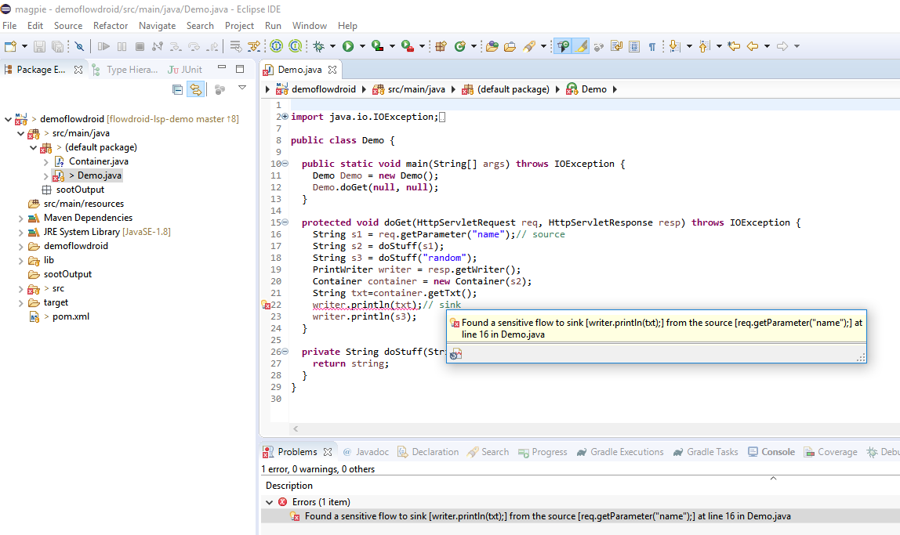
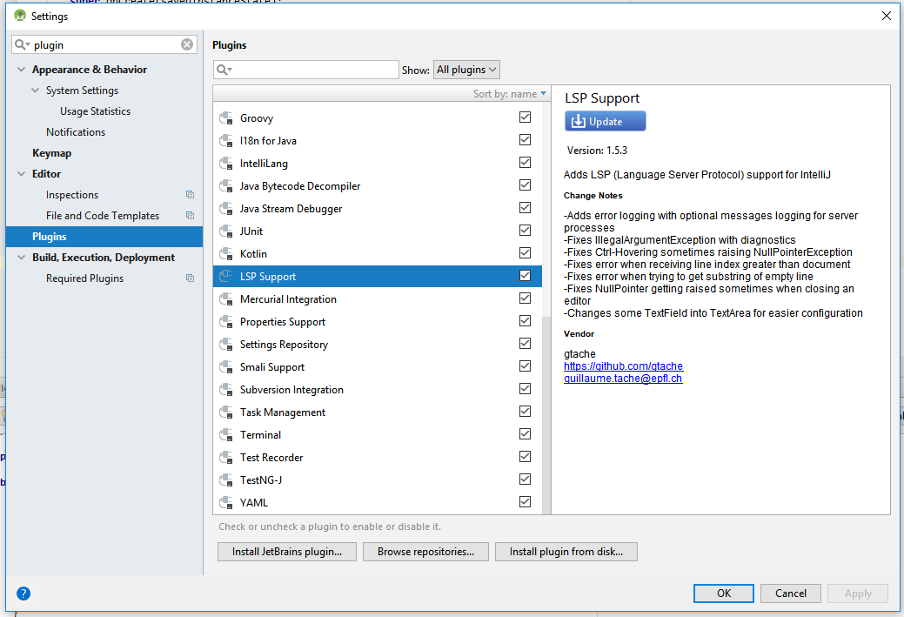
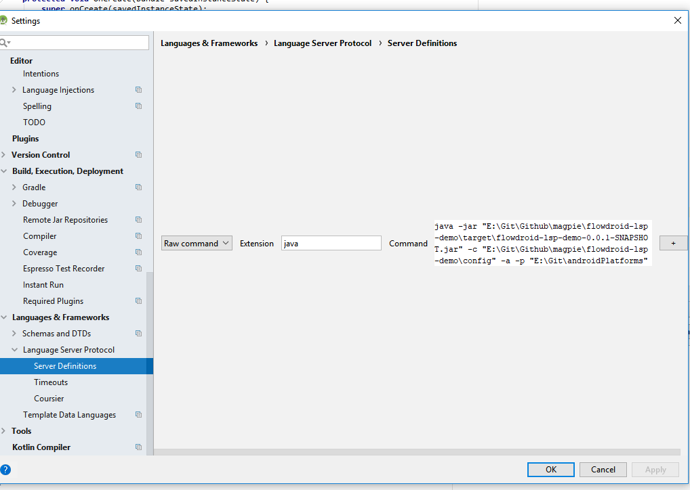

# FlowDroidLSPDemo
This project demonstrate integrating FlowDroid into different IDEs with [MagpieBridge](https://github.com/MagpieBridge/MagpieBridge).

## Build FlowDroidLSPDemo with Maven

1. check out adapted FlowDroid with
```git checkout -b lsp https://github.com/linghuiluo/FlowDroid.git```
2. install FlowDroid into your local maven repository with `mvn install -DskipTests`
3. A jar file called `flowdroid-lsp-demo-0.0.1-SNAPSHOT.jar` will be created in the `target` directory. Use it to configure the a language server in an editor following the step 11 from this [tutorial](https://github.com/MagpieBridge/MagpieBridge/wiki/Create-your-first-project-with-MagpieBridge) 

## Run FlowDroidLSP in IDEs
1. Run FlowDroidLSPDemo with this [demo Java Project](https://github.com/MagpieBridge/FlowDroidLSPDemo/tree/master/src/test/resources/DemoFlowDroid) in Eclipse: 
  - use the following arguments for the lanuch configuration 
   ```-jar PATH_TO_LOCAL_REPO\flowdroid-lsp-demo\target\flowdroid-lsp-demo-0.0.1-SNAPSHOT.jar -c  PATH_TO_LOCAL_REPO\flowdroid-lsp-demo\config```
  - Import [DemoFlowDroid](https://github.com/MagpieBridge/FlowDroidLSPDemo/tree/master/src/test/resources/DemoFlowDroid) as Maven project in Eclipse.
  - Open a Java file in this project, this will trigger the server to run FlowDroid.
  - You should see a warning shown in Eclipse as in the following screenshot.      
    

2. Run FlowDroidLSPDemo with this [demo Java Project](https://github.com/MagpieBridge/FlowDroidLSPDemo/tree/master/src/test/resources/DemoFlowDroid) in Visual Studio Code:
  - navigate to `PATH_TO_LOCAL_REPO\flowdroid-lsp-demo\vscode`
  - run `vsce package`
  - install the FlowDroidLSP extension with `code --install-extension FlowDroidLSP-0.0.1.vsix`
  - watch a demo vido on Youtube
  
  [](http://www.youtube.com/watch?v=S89_V9DGtrk)

3. Run FlowDroidLSPDemo with this [demo Android Project](https://github.com/MagpieBridge/FlowDroidLSPDemo/tree/master/src/test/resources/DemoFlowDroidAndroid) in Android Stuido:
  - install LSP Support Plugin in Android Studio
    
  - use the following arguments for defining a language server
    java -jar "PATH_TO_LOCAL_REPO\flowdroid-lsp-demo\target\flowdroid-lsp-demo-0.0.1-SNAPSHOT.jar" -c `PATH_TO_LOCAL_REPO\flowdroid-lsp-demo\config" -a -p "PATH_TO_ANDROID_PLATFORMS`
     
   - Open [DemoFlowDroidAndroid](https://github.com/MagpieBridge/FlowDroidLSPDemo/tree/master/src/test/resources/DemoFlowDroidAndroid) in Android Studio.
   - Open a Java file in this project, this will trigger the server to run FlowDroid. It takes a few seconds for FlowDroid to finish the analysis on this Android project. 
   - watch a demo video on Youtube
   
  [](http://www.youtube.com/watch?v=1kDWslIjPus)
